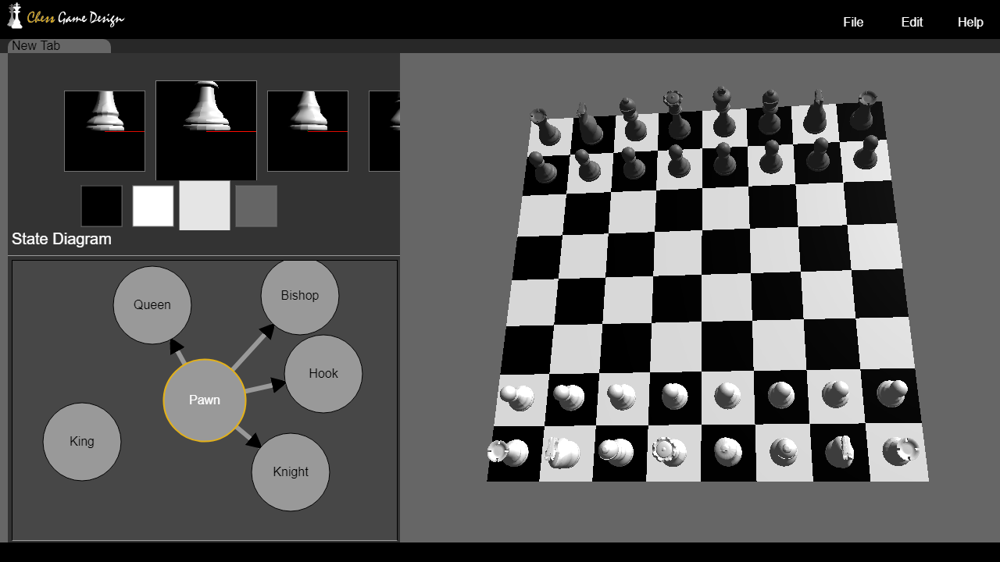

ChessGameMaster
=====
## Screenshot

A chess game engine written in Typescript, Electron, threejs. We aims to minimize programming as possible. Featured Stated-based rule descriptor(SRD) makes the whole process simpler and intuitive.

## State-based Rule Descriptor
All operations to the game leads to some degree of state changes. It can be formally defined as:

$$
(\sigma', P') \equiv T(\sigma, P)
$$

where $T$ is the transition function. The output of $T$ is a tuple of new states. $\sigma$ is world state which describes the state of the board, it allows the function to access the extra information. $P$ is the state of the piece in action. The piece state $P$ contains the position, owner, and mesh/texture.

Takes chess game as example: Pawns can only move forward one square at a time, except for their very first move where they can move forward two squares. We can define a transition that convert the pawn $P$ into forward-one-square state $P'$ after the first move.

## Stage
This project is still unfinished and under development..